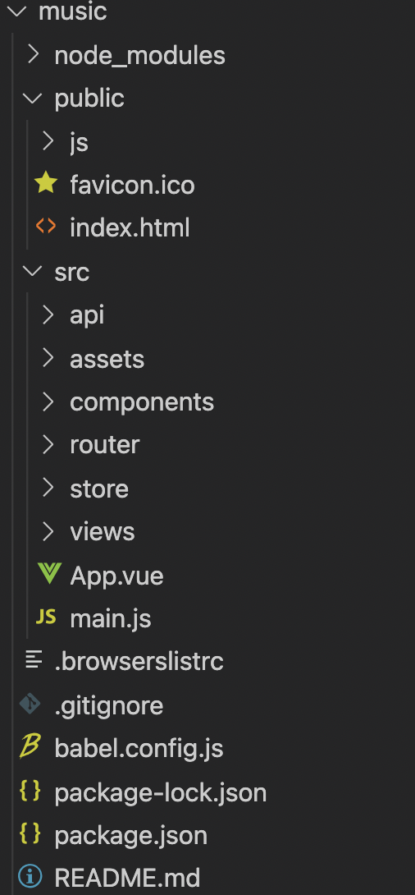

### Vue项目目录



```ba
-public:定义全局的设置以及入口文件（比如rem定义等）
-vue.config.js:项目完成后打包时的配置文件
-src:定义所有的页面、路由、与后端交互等主体文件
-api:定义与后端的ajax请求
-assets:定义所有需要的img等信息
-components:定义构成页面的部分组件
-router:定义所有views下的路由信息
-store:定义vuex的状态信息（vuex的核心是store，相当于一个容器，store包含状态，状态和全局信息的不同之处在于，vuex状态是响应式变化的，改变状态的的唯一途径是显示地提交commit）
-views:定义web包括的所有的页面信息
-App.vue:定义全局显示的一些组件等配置信息
-main.js:挂载到public下的index.html上
```

### 生命周期钩子函数


### 一些小tips

* router路由跳转（在html标签中跳转）

```html
<div class="back" @click="$router.go(-1)">
        <svg class="icon" aria-hidden="true">
          <use xlink:href="#icon-jiantou_liebiaoxiangzuo"></use>
        </svg>
        <div class="title">歌单</div>
</div>
```

```html
<div class="topRight" @click="$router.push('/searchview')">
      <svg class="icon search" aria-hidden="true">
        <use xlink:href="#icon-sousuo"></use>
</svg>
```

+ router获取url中的query信息

```javascript
const route = useRoute()
        onMounted(async ()=>{
            let id = route.query.id
            console.log(id)
            let res = await getPlaylistDetail(id);
            state.playlist = res.data.playlist
            state.creator = res.data.playlist.creator
            store.commit('setPlaylist', state.playlist.tracks)
            console.log(res)
        })
```

+ rem.js

```javascript
function remSize() {
    var deviceWidth = document.documentElement.clientWidth || window.innerWidth
    if(deviceWidth >= 750)
        deviceWidth = 750
    if(deviceWidth <= 320)
        deviceWidth = 320
    document.documentElement.style.fontSize = (deviceWidth / 7.5) + 'px'
    document.querySelector('body').style.fontSize = 0.3 + 'rem'
}

remSize()

window.onresize = function() {
    remSize()
}
```


### 一些依赖

```bash
常用依赖：
npm install axios --save
npm install swiper@6 --save
npm install vue-awesome-swiper@3 --save-dev

创建项目：
vue create music
安装依赖：
npm install
启动：
npm run serve
打包：
npm run build
```


### gin项目目录


```bash
-main.go:通过dao层配置数据库连接以及关闭，建立路由引擎并启动
-routers:配置路由引擎，加载模板配置路由组等信息
-controller:对路由过来的处理进行转发
-logic:业务逻辑处理
-models:模型层的定义和增删改查
-dao:数据库连接和关闭
```

### 数据库配置

```go
//连接前库已经存在
import (
	"github.com/jinzhu/gorm"
	_ "github.com/jinzhu/gorm/dialects/mysql"
)

var DB *gorm.DB

func InitMySQL() (err error) {
	dsn := "root:Jiangshu123@(127.0.0.1:3306)/db1?charset=utf8mb4&parseTime=True&loc=Local"
	DB, err = gorm.Open("mysql", dsn)
	if err != nil {
		return
	}
	return DB.DB().Ping()
}

func Close() {
	DB.Close()
}
```

```go
//创建数据库表
dao.DB.AutoMigrate(&models.Todo{})
```


### 依赖

```go
gin框架：
"github.com/gin-gonic/gin"
gorm:
"github.com/jinzhu/gorm"
_ "github.com/jinzhu/gorm/dialects/mysql"
```


